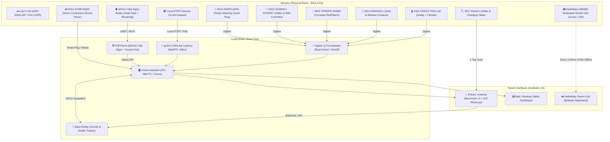

# 🍼 BabyStack: Lily's Smart Nursery Plan

> A safe, private, local-first smart nursery blueprint built for baby **Lily**. Powered by **Home Assistant**, **Baby Buddy**, **Zigbee/Thread**, and **Local RTSP**.

---

## 🌟 Overview & Philosophy

**BabyStack** is a complete, production-grade guide and configuration repository for designing, building, and running an automated, health-conscious nursery.

Parenting a newborn is exhausting. 3:00 AM feedings, sleep tracking, and temperature checks should not require opening complex apps, staring into blinding blue screens, or trusting cloud cameras that could leak video or fail when the internet drops.

### Core Principles

1. **Safety Redundancy (Non-Negotiable)**
   * Smart home tech *augments* parenting; it never replaces fundamental baby safety.
   * A dedicated, offline FHSS/DECT audio monitor serves as an unhackable, zero-latency fail-safe alongside smart video cameras.
   * Strict cord management: zero wires within 3 feet (1 meter) of the crib.
2. **Privacy by Design (Local-First)**
   * No proprietary cloud cameras in Lily's room.
   * Video streams (RTSP/WebRTC) and sensor telemetry stay 100% inside your local network.
3. **Gentle Circadian Lighting & Acoustics**
   * Nighttime automations utilize deep red (650nm+) light to protect Lily's and parents' natural melatonin production.
   * Automated white noise management to cushion against household noises.
4. **Frictionless Parent UX**
   * Aesthetic, intuitive UI designed for tired parents.
   * 1-tap physical Zigbee buttons and invisible NFC stickers on the changing pad and rocking chair for zero-screen logging.

---

## 🏗️ Architecture Diagram

---

## 📂 Repository Structure & Navigation

| Document / Directory | Description |
| :--- | :--- |
| **[`docs/shopping-list.md`](file:///c:/Users/sacha/src/babystack/docs/shopping-list.md)** | Curated hardware recommendations, tiered budgets (Starter, Balanced, Pro), specs, and purchase links. |
| **[`docs/installation-guide.md`](file:///c:/Users/sacha/src/babystack/docs/installation-guide.md)** | Step-by-step physical room babyproofing, camera angles, network VLAN isolation, and Home Assistant setup. |
| **[`docs/technology-stack.md`](file:///c:/Users/sacha/src/babystack/docs/technology-stack.md)** | Deep-dive into local-first tech (Zigbee/Thread vs Wi-Fi, go2rtc, Baby Buddy architecture, threat models). |
| **[`docs/automations-and-ideas.md`](file:///c:/Users/sacha/src/babystack/docs/automations-and-ideas.md)** | 3:00 AM gentle routines, climate guards, NFC workflows, plus future toddler expansions (OK-to-wake, story cards). |
| **[`configs/home-assistant/`](file:///c:/Users/sacha/src/babystack/configs/home-assistant/)** | Ready-to-use Home Assistant automations (`automations.yaml`) and Lovelace dashboards (`nursery-dashboard.yaml`). |
| **[`configs/esphome/`](file:///c:/Users/sacha/src/babystack/configs/esphome/)** | Custom ESP32 sensor hub blueprint (ambient sound dB meter + circadian nightlight). |
| **[`configs/docker/`](file:///c:/Users/sacha/src/babystack/configs/docker/)** | Docker Compose deployment for standalone Baby Buddy + PostgreSQL setups. |

---

## 🛡️ Safe Sleep Environmental Targets

BabyStack enforces strict monitoring against recommended pediatric safe-sleep ranges:

* **Room Temperature**: `18°C – 20°C (64°F – 68°F)` (Overheating is a known SIDS risk factor).
* **Relative Humidity**: `40% – 60%` (Protects delicate infant nasal passages and skin).
* **Air Quality (PM2.5)**: `< 10 µg/m³` | **CO2**: `< 800 ppm` (Alerts for window ventilation).
* **Night Light Spectral Output**: `> 630 nm (Deep Red)` at `< 10% brightness` (Zero blue-light melatonin suppression).
* **Sound Machine Volume at Crib**: `50 – 60 dB(A)` (Safe auditory range to prevent hearing strain while masking sudden noises).

---

## 🚀 Quick Start

1. Review the **[Shopping List](file:///c:/Users/sacha/src/babystack/docs/shopping-list.md)** to select your hardware tier.
2. Follow the **[Installation Guide](file:///c:/Users/sacha/src/babystack/docs/installation-guide.md)** to isolate your IoT network and babyproof cables.
3. Import **[Automations](file:///c:/Users/sacha/src/babystack/configs/home-assistant/automations.yaml)** and **[Dashboard](file:///c:/Users/sacha/src/babystack/configs/home-assistant/dashboards/nursery-dashboard.yaml)** into Home Assistant.
