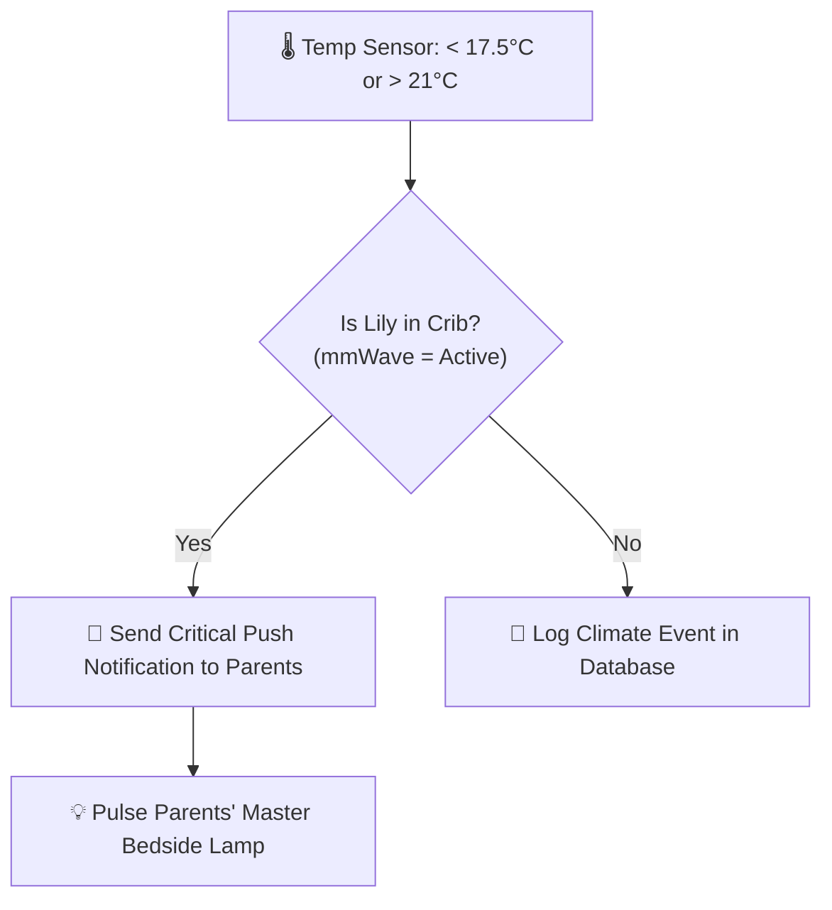

# 💡 Smart Nursery Automations & Creative Ideas

This guide contains practical automation recipes for baby **Lily's** nursery today, followed by creative expansions for her toddler years and whole-home smart integrations.

---

## 🍼 Part 1: Core Infant Automations

### 1. The 3:00 AM Gentle Feeding Scene
* **The Goal**: Allow parents to see clearly during night feeds without exposing Lily or themselves to blue-spectrum light, preserving melatonin and sleep inertia.
* **Trigger**: 1-click on the glider Zigbee button, or scanning the "Feeding" NFC tag on the chair armrest.
* **Actions**:
  1. Floor lamp transitions to **Deep Red (650nm / `#FF0000`)** at **6% brightness** smoothly over 4 seconds.
  2. If the sound machine is blaring, reduce volume by 20% for comfortable parent conversation.
  3. Start the Baby Buddy nursing timer on the last recommended breast side.
* **Reset**: Long-press button or scan tag again $\rightarrow$ lamp smoothly fades to 0% over 6 seconds.

---

### 2. The Diaper Change Light Boost
* **The Goal**: Provide adequate lighting to check for diaper rash or clean up blowouts without blinding anyone.
* **Trigger**: 2-clicks on the glider button OR scanning the changing table NFC sticker.
* **Actions**:
  1. Light shifts to **Warm Amber (2200K)** at **20% brightness**.
  2. Logs a diaper change event in Baby Buddy with timestamp.

---

### 3. Safe Sleep Climate & Thermal Guard
* **The Goal**: Prevent dangerous overheating ($> 21^\circ\text{C} / 70^\circ\text{F}$) or chilling ($< 17^\circ\text{C} / 63^\circ\text{F}$).
* **Triggers**: Temperature sensor crosses safe boundaries while Lily is in the crib (presence detected).
* **Actions**:
  1. Send a **High-Priority Critical Alert** to parents' smartphones (bypassing Do Not Disturb).
  2. If parents are asleep, pulse the master bedroom bedside lamp in subtle blue (too cold) or soft red (too hot).

---

### 4. Nursery Air Quality & Ventilation Reminder
* **The Goal**: Ensure fresh oxygenation during long naps with closed doors.
* **Trigger**: Nursery $\text{CO}_2 > 1000\text{ ppm}$ or $\text{PM2.5} > 15\ \mu\text{g/m}^3$ for $> 15\text{ minutes}$.
* **Action**: Push notification to parents: *"Lily's nursery air is getting stale. Consider cracking the door or window for 5 minutes."*

---

### 5. Automated Nap & Sleep Tracking (Hands-Free)
* **The Goal**: Automatically log sleep start and wake times without manual entry.
* **Logic**:
  * **Sleep Start**: mmWave radar detects sustained crib presence for $> 3\text{ minutes}$ AND nursery door is closed AND room luminance is low $\rightarrow$ Home Assistant automatically calls `baby_buddy.start_sleep`.
  * **Wake Up**: mmWave detects high motion (baby sitting/standing up) AND door opens $\rightarrow$ Home Assistant ends sleep timer and calculates total nap duration.

---

### 6. Automated Tummy Time Tracker & Activity Gym Trainer
* **The Goal**: Automatically track Lily's daily tummy time exercises (pediatric target: 15–30 mins/day) and make it an engaging sensory experience.
* **How It's Measured**:
  1. **Camera AI Classification (Frigate / MediaPipe)**: Define a "Play Mat Zone" on the floor. When computer vision detects a baby in a prone posture (horizontal body axis with head lifted) in the zone, Home Assistant triggers `baby_buddy.start_tummy_time`. When picked up, it logs the exact session duration and sends a summary push notification: *"🌟 Lily completed 5m 20s of tummy time!"*
  2. **Smart Pressure Mat (Alternative / Zero-Camera)**: A flat $8 car-seat pressure pad slipped under the play mat wired to an IKEA PARASOLL contact sensor. Placing baby on the mat automatically starts the timer.
  3. **1-Tap NFC Tag on the Toy Arch**: Simply tap your phone against the activity gym's wooden arch when laying her down.
* **Sensory Enhancements During Tummy Time**:
  * Home Assistant gently ramps up the room lighting to stimulating daylight (4000K) to encourage head-lifting and visual tracking.
  * Plays cheerful acoustic nursery melodies on the **IKEA SYMFONISK** speaker.
  * When Lily hits her daily 20-minute goal, the room lights flash a fun celebration sparkle and increments the milestone counter!

---

### 7. Predictive Health & Vital Signs Analytics (Heart Rate + Respiration)
When using a 60GHz vital-signs radar, Home Assistant can predict illness, sleep quality, and comfort before visible symptoms emerge:

1. **Early Fever & Illness Warning (Before Physical Symptoms)**:
   * *Medical Fact*: In infants, resting heart rate increases by **10 to 12 BPM for every $1^\circ\text{C}$ of fever** ($1.8^\circ\text{F}$).
   * *Automation*: If Lily's resting sleeping heart rate rises $\ge 15\text{ BPM}$ above her 7-day rolling baseline for $>45\text{ minutes}$ while lying still, Home Assistant sends an early warning alert: *"⚠️ Lily's resting heart rate is elevated (128 BPM vs 105 BPM baseline). She may be incubating a fever or viral infection."*
2. **True Sleep Architecture (REM vs Deep NREM)**:
   * Low, steady heart rate + slow breathing $\rightarrow$ **Deep Restorative NREM Sleep**.
   * High Heart Rate Variability (HRV) + fluttering breaths $\rightarrow$ **Active REM Brain Development Sleep**.
3. **Colic, Gas & Teething Discomfort Detector**:
   * Sudden spikes in heart rate during sleep without full wakefulness or room temperature changes alert parents to digestive gas or reflux discomfort before crying begins.
4. **Soothing Efficiency Tracker**:
   * Measures how quickly Lily's heart rate decelerates when rocking in the glider with white noise vs alone in the crib.

---

## 🧸 Part 2: Toddler Stage Expansions (Ages 1 to 4)

As Lily grows, the same BabyStack hardware easily transitions into powerful toddler tools:

### 1. The "OK to Wake" Circadian Clock
* **The Problem**: Toddlers wake up at 5:30 AM and don't know if it's still nighttime.
* **The Solution**: 
  * **Sleep Time (7:00 PM – 6:50 AM)**: Nightlight stays off or dim red.
  * **Almost Time (6:50 AM – 7:00 AM)**: Light shifts to soft **warm yellow** (toddler knows morning is almost here and stays in bed quietly).
  * **OK to Wake (7:00 AM)**: Light turns soft **green** (Lily knows she is allowed to get out of bed and call mommy/daddy).

---

### 2. Magic RFID / NFC Bedtime Story Cards
* **Concept**: Give Lily physical wooden tokens or printed cards with pictures of her favorite stories/lullabies.
* **Hardware**: An ESP32 with an RC522 RFID reader enclosed in a child-safe wooden box.
* **How it works**:
  * Lily places the "Peter Rabbit" card on the box.
  * Home Assistant immediately streams the audiobook to the nursery speaker at a gentle volume.
  * Fosters autonomy and love of books without screen time!

---

### 3. Potty Training Victory Button
* **Concept**: A large, colorful Zigbee arcade button mounted near the toddler potty.
* **How it works**: When Lily successfully uses the potty, she presses the button:
  * Room lights cycle through a 5-second celebratory rainbow animation.
  * Plays a fun fanfare chime on the smart speaker.
  * Home Assistant increments a daily potty counter on the kitchen dashboard.

---

### 4. Toddler "Night Patrol" Floor-Level Guide
* **Concept**: An ultra-low brightness LED strip mounted underneath the bed or baseboards.
* **How it works**: If Lily gets out of bed at night (detected by mmWave or under-bed pressure mat), the floor-level LED gently illuminates the path to the bathroom or door at 2% warm amber, preventing trips and fear in the dark.

---

## 🏡 Part 3: Whole-Home Smart Integrations

Using the BabyStack foundation, you can link the nursery with the rest of your home:

### 1. The "Baby Sleeping" Whole-House Hush Mode
* When Lily's sleep state is `Active`:
  * **Smart Doorbell**: Mutes the physical front door chime; routes doorbell presses to silent phone push notifications or flashing a muted lamp in the living room.
  * **Living Room TV / Soundbar**: Caps maximum volume at 40% and automatically enables "Night Mode / Dialogue Boost".
  * **Robot Vacuum**: Excludes the nursery and hallway zone from automated cleaning runs.

---

### 2. Smart Bottle Warmer Finish Notification
* **Hardware**: Sonoff S31 Smart Plug with power monitoring attached to the bottle warmer.
* **Automation**:
  1. When power draw $> 100\text{W}$, state becomes `Warming`.
  2. When power draw drops back to $< 2\text{W}$ after heating cycle finishes, Home Assistant:
     * Sends a push notification: *"Lily's bottle is ready!"*
     * Gently flashes the kitchen under-cabinet LED in green.

---

### 3. Safe Medication & Fever Interval Watchdog
* **The Problem**: Giving baby fever medication (e.g. Paracetamol / Ibuprofen) at 2 AM is stressful, and keeping track of required 4-to-6 hour intervals while sleep-deprived is prone to human error.
* **The Solution**:
  * Stick an NFC tag on the medicine box.
  * When scanned with a phone, Home Assistant records the dose time, calculates the exact time the next dose is permitted, and schedules a reminder notification.
  * Prevents accidental double-dosing between both parents.

---

### 4. Living Room Samsung The Frame TV: "Art Mode" Status Canvas
* **The Goal**: Display live nursery telemetry (Lily's sleep duration, room temp, last feed) directly in the living room on **Samsung The Frame TV**, while **preserving 100% genuine Art Mode** (matte finish, sub-50W power consumption, auto-dimming ambient light sensor, and motion sleep).
* **How it Works (The Dynamic Canvas Technique)**:
  * Since Tizen OS doesn't allow floating web browsers over native Art Mode, Home Assistant uses a lightweight Python script (`scripts/generate_frame_art_overlay.py`) to compose a 4K image (`3840x2160`).
  * It takes your favorite artwork (or family photo) and stamps an ultra-minimalist, elegant "Museum Plaque" status bar along the bottom edge:
    $$\text{🌸 Lily: Sleeping (1h 12m) } \mid \text{ 🌡️ 19.4°C } \mid \text{ 🍼 Last fed 2h ago}$$
  * When an event changes (Lily wakes up, goes to sleep, or every 15 minutes), Home Assistant automatically uploads the new canvas to the TV via the `ha-samsungtv-smart` Art Mode API.
* **Urgent Cry Pop-up**: If Lily cries for $> 30\text{ seconds}$ while you are watching TV or in Art Mode, Home Assistant sends a Picture-in-Picture RTSP video feed notification in the corner of the screen for 45 seconds, then gracefully reverts to Art Mode.

