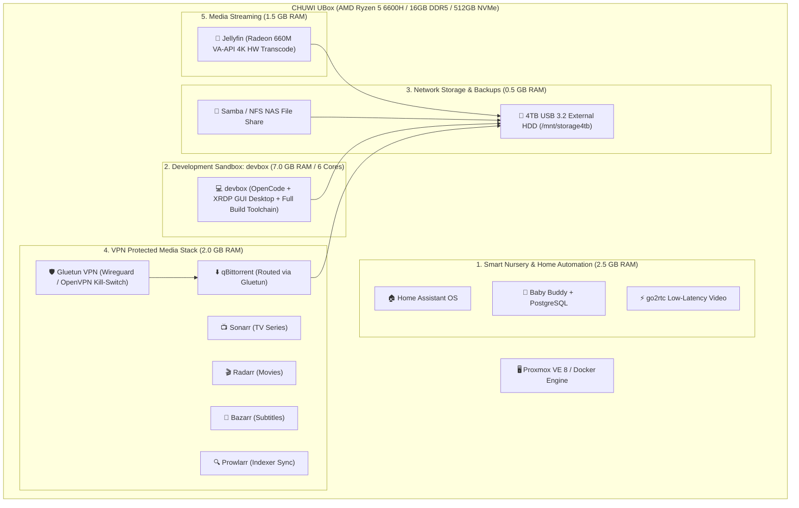

# 🚀 Multi-Service Homelab Architecture & Deployment Guide

> Blueprint for hosting **Smart Nursery (Home Assistant + Baby Buddy)**, **Dev Server (OpenCode)**, **4TB NAS**, **Media Stack (Gluetun + ARR + Jellyfin)**, and **Photo Sync (Immich)** on the **CHUWI UBox (AMD Ryzen 5 6600H / 16GB DDR5)**.

---

## 🏗️ 1. All-in-One Server Architecture



---

## 💾 2. RAM & CPU Resource Allocation (16 GB Total Budget)

```
+---------------------------------------------------------------------------------------+
|                       REALLOCATED 16 GB DDR5 RAM ALLOCATION (DEVBOX FOCUS)            |
+------------------------------------+----------------+----------------+----------------+
| Service Stack                      | RAM Allocated  | CPU Cores      | Storage Target |
+------------------------------------+----------------+----------------+----------------+
| Proxmox Host OS / Kernel           | 1.0 GB         | Shared         | 512GB NVMe     |
| Home Assistant OS (VM 100)         | 2.5 GB         | 2 vCPUs        | 512GB NVMe     |
| Baby Buddy + PostgreSQL (LXC 106)  | 0.5 GB         | 1 vCPU         | 512GB NVMe     |
| ⭐ devbox Sandbox (LXC/VM 101)     | 7.0 GB         | 6 vCPUs        | 512GB NVMe     |
| Samba / NFS NAS Server (LXC 102)   | 0.5 GB         | 1 vCPU         | 4TB USB HDD    |
| Gluetun + qBittorrent + ARR (103)  | 2.0 GB         | 2 vCPUs        | 4TB USB HDD    |
| Jellyfin (VA-API HW GPU) (LXC 104) | 1.5 GB         | 2 vCPUs + GPU  | 4TB USB HDD    |
+------------------------------------+----------------+----------------+----------------+
| TOTAL ALLOCATED (Immich Skipped)   | ~15.0 GB / 16GB (Full power given to devbox!)    |
+------------------------------------+----------------+----------------+----------------+
```

---

## 🖥️ 3. Accessing Your `devbox` (Remote Desktop, Screen & Web IDE)

You have 3 ultra-convenient ways to use your `devbox` as your daily sandbox:

### Option A: Ultra-Fast Remote Desktop (RDP via Windows `mstsc`) ⭐ (Recommended)
You can RDP directly into a smooth, high-resolution Linux graphical desktop from any PC, laptop, or Mac on your network:

1. **Inside `devbox` container/VM**, install XFCE desktop & XRDP:
   ```bash
   apt update && apt install -y xfce4 xfce4-goodies xrdp dbus-x11
   systemctl enable xrdp && systemctl start xrdp
   adduser devuser
   ```
2. **On your Windows PC/Laptop**:
   * Press `Win + R`, type **`mstsc`** (Remote Desktop Connection), and hit Enter.
   * Enter the devbox IP: **`192.168.1.101`**.
   * Log in with `devuser` to get an instantaneous, full 4K 60fps graphical Linux desktop with shared clipboard and audio!

### Option B: Physical Monitor & Keyboard Plugged Into the CHUWI UBox
* **Direct TTY Terminal**: By default, plugging an HDMI/DP cable and USB keyboard into the UBox gives you a direct, zero-lag Linux terminal console.
* **Direct Graphical Desktop on Physical Display**: If you want the physical HDMI monitor to show the `devbox` graphical desktop directly, you can pass through the AMD Radeon 660M display to `devbox` or install a lightweight display manager on the host (`apt install xinit xfce4`).

### Option C: Browser-Based OpenCode / VS Code Remote
* **Web IDE**: Open `http://192.168.1.101:8443` in any browser to get a full VS Code / OpenCode development environment with integrated terminal, extensions, and git.
* **VS Code Remote SSH**: In desktop VS Code, connect to `ssh devuser@192.168.1.101` for native local-feeling editing while all compiling runs on the UBox.

---

## 💽 3. 4TB External USB HDD Directory Structure

Format the 4TB drive as **`ext4`** with label `STORAGE4TB` mounted at `/mnt/storage4tb`:

```
/mnt/storage4tb/
├── data/
│   ├── media/
│   │   ├── movies/          <-- Radarr library destination
│   │   └── tv/              <-- Sonarr library destination
│   ├── torrents/
│   │   ├── downloading/     <-- qBittorrent active downloads
│   │   └── completed/       <-- qBittorrent completed seeding
│   ├── photos/
│   │   ├── immich-library/  <-- Immich original photos & videos
│   │   └── backups/         <-- Phone camera auto-sync
│   └── nas-shares/
│       ├── personal/        <-- Private Samba encrypted share
│       └── family/          <-- General household documents & media
└── backups/
    ├── homeassistant/       <-- Nightly HA automated snapshot export
    └── babybuddy-db/        <-- Nightly PostgreSQL dump
```

---

## 🍿 4. Hardware Accelerated Media Transcoding (Radeon 660M)

In **Jellyfin** → **Admin Dashboard** → **Playback**:
1. **Transcoding Engine**: Select **`VA-API`** (or `AMF`).
2. **VA-API Device**: `/dev/dri/renderD128`.
3. **Hardware Decoding**: Enable `H.264`, `HEVC (8-bit & 10-bit)`, `VP9`, and `AV1`.
4. **Hardware Encoding**: Enable `H.264` and `HEVC`.
5. *Result*: The AMD Radeon 660M RDNA 2 engine handles full 4K 10-bit HEVC transcoding at ~120+ FPS with only 2–5% CPU load.

---

## 🛡️ 5. Gluetun VPN Routing Architecture

All torrent traffic is physically locked behind **Gluetun VPN**:
* If the VPN connection drops for even a millisecond, Gluetun's built-in **firewall kill-switch** blocks all traffic instantly, guaranteeing zero IP leaks.
* Sonarr, Radarr, and Bazarr communicate with qBittorrent through the internal Docker network on `localhost:8080`.
* Jellyfin and Samba remain completely outside the VPN, accessible at full 2.5Gbps LAN speeds.

---

## 🚀 6. Quick Start with Docker Compose

See [`configs/docker/docker-compose.homelab.yml`](file:///c:/Users/sacha/src/babystack/configs/docker/docker-compose.homelab.yml) for the ready-to-run multi-service stack.
