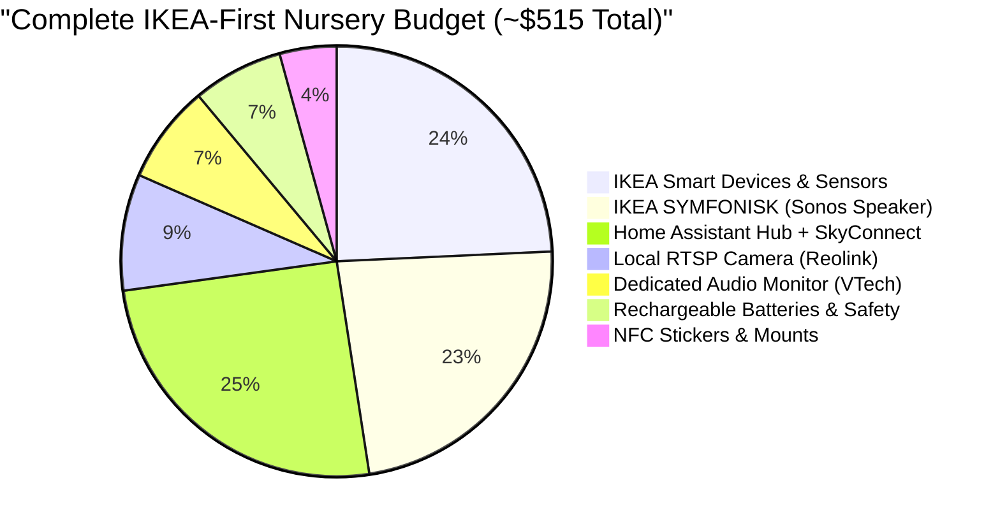

# 🛒 IKEA-First Smart Nursery Shopping Guide (BabyStack)

This shopping list is optimized around the **IKEA Home Smart (Zigbee 3.0 / Matter)** ecosystem. 

IKEA is currently the industry leader in affordable, beautifully designed, and standardized Zigbee smart home hardware. Their newest generation of sensors (PARASOLL, VALLHORN, SOMRIG, INSPELNING) uses standard rechargeable **AAA batteries** instead of disposable coin cells, eliminating ongoing battery waste.

---

## 🇸🇪 Why the IKEA Ecosystem is Ideal for BabyStack

1. **100% Standard Zigbee 3.0**: IKEA devices pair directly with **Home Assistant** (via SkyConnect or Sonoff Dongle-E) **without needing the $69 IKEA DIRIGERA hub**.
2. **Rechargeable AAA Batteries**: IKEA's new sensors use standard AAA batteries. Paired with **IKEA LADDA** rechargeable batteries, your ongoing battery replacement cost is $0.
3. **Mains-Powered Mesh Repeaters**: Every IKEA smart bulb and smart plug acts as a Zigbee Router, creating a rock-solid mesh signal throughout the nursery.
4. **Sonos Audio Inside (SYMFONISK)**: Genuine Sonos acoustic hardware and software at half the price of standalone Sonos units.
5. **Ultra Affordable**: Contact sensors for $9.99, smart plugs with energy metering for $9.99, and RGB bulbs for $12.99.

---

## 🏬 Part 1: The Master IKEA Shopping Basket

```
+---------------------------------------------------------------------------------------+
|                              THE COMPLETE IKEA NURSERY HAUL                           |
+-------------------+----------------------------+-----------------------+--------------+
| Category          | IKEA Product Name          | Spec / Protocol       | Approx. Price|
+-------------------+----------------------------+-----------------------+--------------+
| Air & Climate     | IKEA VINDSTYRKA            | PM2.5, VOC, Temp, Hum | $39.99       |
| Audio & Speaker   | IKEA SYMFONISK Bookshelf   | Sonos Wi-Fi / AirPlay | $119.99      |
| Door / Window     | IKEA PARASOLL (x2)         | Zigbee Contact (1xAAA)| $19.98 (2x)  |
| Motion / Light    | IKEA VALLHORN              | Zigbee PIR (2xAAA)    | $9.99        |
| Glider Controller | IKEA SOMRIG Shortcut Button| Zigbee 2-Btn (6 acts) | $9.99        |
| Wall Dimmer       | IKEA RODRET Wireless Switch| Zigbee Rocker Dimmer  | $7.99        |
| Shelf Moon Lamp   | **IKEA FADO (Opal Glass)** | 17cm/25cm Frosted Ball| $14.99       |
| Smart Lighting    | IKEA TRÅDFRI/KAJPLATS RGBW | Matter/Zigbee Color    | $12.99       |
| Smart Plug (Power)| IKEA INSPELNING            | Zigbee Power Meter    | $9.99        |
| Smart Plug (Basic)| IKEA TRETAKT               | Zigbee On/Off         | $7.99        |
| Rechargeables     | IKEA LADDA AAA (4-pack) x2 | 750mAh NiMH (Japan)   | $13.98 (2x)  |
| Battery Charger   | IKEA STENKOL Charger       | 4-slot Fast Charger   | $6.99        |
| Cable Safety      | IKEA MONTERA / SIGNUM      | Cable Trunking Trunk  | $9.99        |
| Babyproofing      | IKEA PATRULL Corner/Plugs  | Child Safety Kit      | $6.99        |
+-------------------+----------------------------+-----------------------+--------------+
|                   |                            | IKEA SUB-TOTAL        | ~$301.00     |
+-------------------+----------------------------+-----------------------+--------------+
```

---

## 🔌 Part 2: Non-IKEA Hardware (Essential Core Additions)

IKEA does not manufacture compute servers, security cameras, or 60GHz vital-signs radars. These 5 items complete the system:

| Device | Purpose | Brand / Model | Approx. Price |
| :--- | :--- | :--- | :--- |
| **Home Assistant Hub** | Central offline automation brain | **Home Assistant Green** OR **Intel N100 Mini PC** | $99 – $140 |
| **Zigbee & Thread Dual-Radio Coordinator** | **Dual-Chip Ethernet/PoE** (CC2652P for Zigbee + EFR32MG21 for Thread/Matter) | **SMLIGHT SLZB-MR2U** *(Domadoo.fr)* | **~44 €** |
| **60GHz Vital Signs Radar** | **Contactless Heartbeat & Breathing Sensor** (ESPHome/Wi-Fi) | **Seeed Studio MR60BHA1 60GHz Radar** (or pre-assembled ESPHome kit) | $39 – $49 |
| **Local RTSP Camera** | 100% private local baby video feed (WAN isolated) | **Reolink E1 Pro (2K/4K)** OR **TP-Link Tapo C225** | $45 – $55 |
| **Dedicated Offline Baby Monitor** | **Non-negotiable fail-safe** (5" HD screen, 30h battery, 0 lag) | **HelloBaby HB6550 / HB6550 Pro** | **$79** |
| **Decorative Jute Rope Fairy Lights** | 2m warm-white 40-LED boho rope | **Action Corde de Jute LED (Réf 2576933)** | **~3 €** |
| **Zigbee 3.0 LED Dimmer** | DC PWM dimmer (5V–24V) for fairy lights (0–100% fade) | **[Gledopto GL-C-009P Ultra-Thin](https://www.domadoo.fr/fr/produits-de-domotique/9700-gledopto-gl-c-009p-controleur-led-zigbee-pro-ultra-thin-1-couleur.html)** *(Domadoo)* | **~12 €** |
| **NFC Stickers (Optional)**| 1-tap logging under changing table mat & glider | **NTAG215 Matte Tags (Pack of 10)** | $8 |

> [!TIP]
> **French / European Sourcing Tip**: For the **SMLIGHT SLZB-MR2U Dual-Radio Coordinator**, **Gledopto Zigbee dimmers**, and smart accessories, **[Domadoo.fr](https://www.domadoo.fr)** is the premier French home automation retailer. They offer 24–48h Colissimo shipping in France and a 2-year statutory warranty.

---

### 🏆 Best Budget Alternatives to Infant Optics DXR-8 PRO ($170+)
The Infant Optics DXR-8 PRO is great, but overpriced. These non-Wi-Fi (2.4GHz FHSS) monitors offer equal or superior battery and screen quality for 50–70% less:

| Monitor Model | Screen Size / Res | Battery Life | Pan/Tilt/Zoom | Price | Why It Beats Infant Optics |
| :--- | :--- | :--- | :--- | :--- | :--- |
| **HelloBaby HB6550 / HB6550 Pro** *(Best Direct Alternative)* | 5.0" HD IPS | **30h VOX / 16h Video** (5000mAh) | Yes (Remote 355°/120°) | **~$79** | Same 5" screen and motorized PTZ as DXR-8 PRO at less than half the price. |
| **VTech VM819** *(Best Value & Compact King)* | 2.8" LCD | **19h Video / 29h Audio** | Digital Zoom | **~$49** | Incredible battery life; compact and easy to carry around the house or travel. |
| **VTech VM923 / VM924** *(Best Brand Balance)* | 5.0" HD Display | **17h Video / 29h Audio** | Yes (Motorized PTZ) | **~$69** | Large 5" screen, reliable range, sound-level indicator bar. |
| **VTech DM221 (Audio-Only)** *(Most Practical Smart-Home Pairing)* | N/A (Audio + LED bar) | **18h Audio** | N/A | **~$38** | Since you already have a Reolink camera in Home Assistant for video, this provides pure, zero-latency audio on the nightstand. |

## 💰 Complete Budget Breakdown (IKEA-First)



### Complete All-Inclusive Package: **~$515 Total**
* **IKEA Haul**: VINDSTYRKA + SYMFONISK (Sonos) + 2x PARASOLL + VALLHORN + SOMRIG + RODRET + TRÅDFRI RGB Bulb + INSPELNING + TRETAKT + 8x LADDA AAA + STENKOL Charger + Cable Trunking ($286)
* **Smart Core & Camera**: HA Green ($99) + SkyConnect ($30) + Reolink E1 Pro ($45) + VTech DM221 Audio Monitor ($38) + NFC Tags ($8) ($220)

---

## 🛠️ IKEA Hardware Integration Details

### 1. IKEA SYMFONISK (Powered by Sonos)
* **What it is**: Genuine Sonos acoustic drivers and software inside an IKEA-designed body.
* **Home Assistant Integration**: Auto-discovered via the official Sonos integration.
* **Capabilities**:
  * Seamless, infinite offline playback of local continuous **brown noise loops** stored in Home Assistant.
  * Native **AirPlay 2** and **Spotify Connect** for daytime music and lullabies.
  * Automated volume ceiling capped safely at 25% (~52 dB) during sleep hours.

### 2. IKEA VINDSTYRKA (Air Quality & Climate)
* **Sensors Included**: Sensirion PM2.5 particulate meter, tVOC sensor, Temperature, and Relative Humidity.
* **Display**: Large crisp screen on top of the changing table so you can check nursery metrics at a glance without opening an app.
* **Power**: USB-C powered (serves as a continuous Zigbee Router).

### 3. IKEA PARASOLL & VALLHORN (Contacts & Motion)
* **Battery Revolution**: Powered by standard **1x AAA (PARASOLL)** and **2x AAA (VALLHORN)** batteries.
* **LADDA Synergy**: Using IKEA LADDA NiMH rechargeable batteries means zero battery waste.
* **Functions**:
  * Door PARASOLL: Pauses sleep timers or alerts if door is cracked open during naptime.
  * Window PARASOLL: Warns if temperature drops when window is open.
  * VALLHORN: Detects parent entering room to gently turn on floor nightlight.

### 4. IKEA SOMRIG & RODRET (Physical 3 AM Controllers)
* **SOMRIG**: 2 physical buttons with 6 distinct triggers (Single, Double, Long press on each button).
  * *Button 1 Single*: Start 3 AM Deep Red Feeding Scene.
  * *Button 1 Double*: Diaper Change Light Boost (Warm Amber 20%).
  * *Button 2 Single*: Toggle Brown Noise on SYMFONISK.
  * *Button 2 Long*: All Off / Room Sleep Mode.
* **RODRET**: Clean, minimalist wall-mounted dimmer switch.

### 5. IKEA INSPELNING (Power Metering Smart Plug)
* **Why INSPELNING > TRETAKT**: INSPELNING measures active wattage.
* **Nursery Use**: Plug your bottle warmer or humidifier into INSPELNING:
  * When bottle warmer heating cycle ends (power drops from 120W to <2W), Home Assistant sends a notification: *"Lily's bottle is ready!"* and pulses the kitchen light.
