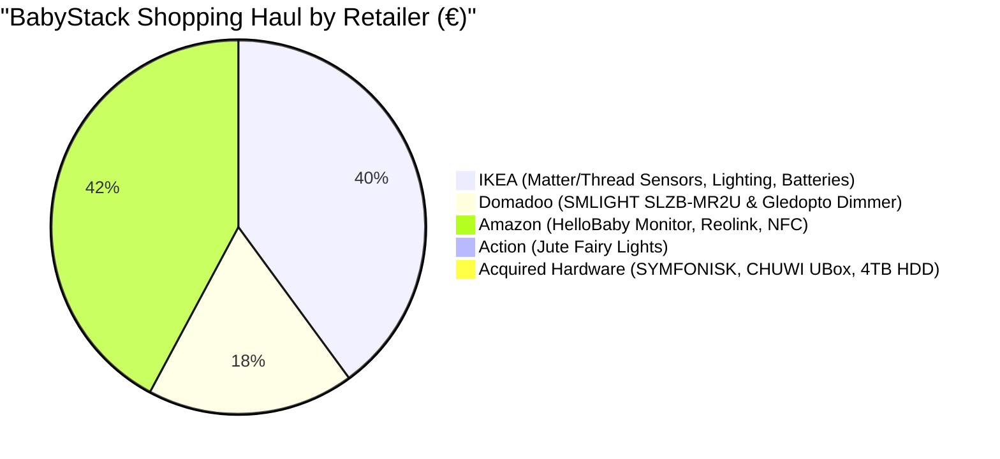

# 🛒 BabyStack Master Shopping Guide (Sorted by Shop)

This shopping list is organized and optimized by **Retailer / Shop** to make purchasing and ordering seamless. 

> [!IMPORTANT]
> **IKEA Hardware Ecosystem Shift (France / Europe)**: IKEA has officially transitioned its smart home lineup in France and Europe from Zigbee to **Matter over Thread** (featuring the new **ALPSTUGA**, **MYGGBETT**, **MYGGSPRAY**, **BILRESA**, **GRILLPLATS**, and **KAJPLATS** product series). 
> 
> Because your **SMLIGHT SLZB-MR2U Coordinator** (from Domadoo) features **dual independent radios (TI CC2652P for Zigbee + Silabs EFR32MG21 for Thread/Matter)**, you get the best of both worlds: full native support for new IKEA Matter-over-Thread devices alongside classic Zigbee hardware without needing an IKEA DIRIGERA hub!

---

## 🏬 Shop 1: 🇸🇪 IKEA (France Latest Matter-over-Thread Lineup)

IKEA is the primary hardware foundation for BabyStack. Their latest generation of smart sensors runs on standard **rechargeable AAA batteries** (LADDA) and communicates via **Matter over Thread**, pairing directly with Home Assistant via the OpenThread Border Router on the SMLIGHT coordinator.

### 📋 IKEA Shopping Basket (SURE List)

| Category | IKEA Product Name (Latest Model) | Tech / Protocol | Approx. Price | Purchase Status | Purpose in Nursery |
| :--- | :--- | :--- | :--- | :--- | :--- |
| **Air & Climate ($\text{CO}_2$)** | **IKEA ALPSTUGA** | **Matter over Thread** (Sensirion $\text{CO}_2$, PM2.5, Temp, Hum, Clock) | **€29.99** | **SURE BUY ✅** | Real-time $\text{CO}_2$ & particulate monitoring with bedside clock & alert LED. |
| **Door / Window Contacts** | **IKEA MYGGBETT (x2)** *(replaces Parasoll)* | **Matter over Thread** Contact Sensor (1x AAA) | **€15.98** *(2x €7.99)* | **SURE BUY ✅** | 1x Nursery door (naptime alerts) + 1x window (ventilation guard). |
| **Motion & Ambient Light** | **IKEA MYGGSPRAY** *(replaces Vallhorn)* | **Matter over Thread** PIR Motion Sensor (2x AAA) | **€9.99** | **SURE BUY ✅** | Floor-level entry trigger for 3 AM diaper change nightlight. |
| **Rocking Chair Controller** | **IKEA BILRESA Remote** *(replaces Somrig/Rodret)* | **Matter over Thread** Smart Shortcut Switch | **€7.99** | **SURE BUY ✅** | Physical button on glider: 1-click feeding scene, sound toggle, sleep mode. |
| **Circadian Nightlight Lamp** | **IKEA FADO (Opal Glass)** | 17cm / 25cm Frosted White Globe (E27) | **€14.99** | **SURE BUY ✅** | Soft, glare-free light diffusion for soothing red/amber circadian glow. |
| **Smart Color Bulb** | **IKEA KAJPLATS RGBW** *(replaces Trådfri)* | **Matter over Thread** Color LED E27 806lm | **€12.99** | **SURE BUY ✅** | Circadian deep red (>650nm) nighttime lighting & warm daytime light. |
| **Smart Plug** | **IKEA GRILLPLATS** *(replaces Tretakt/Inspelning)* | **Matter over Thread** Smart Plug | **€7.99** | **SURE BUY ✅** | Automated power control for bottle warmer or nursery accessories. |
| **Rechargeable Batteries** | **IKEA LADDA AAA (4-pack) x2** | 750mAh NiMH (Made in Japan) | **€13.98** *(2x €6.99)* | **SURE BUY ✅** | Powers all MYGGBETT, MYGGSPRAY, and BILRESA sensors ($0 ongoing battery cost). |
| **Battery Fast Charger** | **IKEA STENKOL Charger** | 4-slot AAA / AA Intelligent Charger | **€6.99** | **SURE BUY ✅** | Safe, fast charging for nursery LADDA rechargeable batteries. |
| **Cable Trunking & Safety** | **IKEA MONTERA / SIGNUM** | Cable Cover Trunking & Organizers | **€9.99** | **SURE BUY ✅** | Conceals and babyproofs all power cables >3 feet away from the crib. |
| **Child Babyproofing Kit** | **IKEA PATRULL** | Corner Bumpers & Power Socket Plugs | **€6.99** | **SURE BUY ✅** | Essential electrical socket covers and sharp edge protection. |

> **IKEA Sub-Total:** **~€124.87**

---

## 🇫🇷 Shop 2: Domadoo.fr (Smart Home & Coordinator)

[Domadoo.fr](https://www.domadoo.fr) is the premier European specialist retailer for open-source home automation, offering 24–48h shipping and local European warranty.

### 📋 Domadoo Shopping Basket (SURE List)

| Device | Purpose | Model / Spec | Approx. Price | Purchase Status |
| :--- | :--- | :--- | :--- | :--- |
| **Dual-Radio Coordinator** | Central Zigbee & Thread antenna (Ethernet PoE/LAN) | **[SMLIGHT SLZB-MR2U](https://www.domadoo.fr)** *(TI CC2652P Zigbee + Silabs EFR32MG21 Thread/Matter + ESP32-S3)* | **~44.00 €** | **SURE BUY ✅ (Confirmed)** |
| **Zigbee 3.0 LED Dimmer** | 0–100% PWM smooth dimming for decorative rope light | **[Gledopto GL-C-009P Ultra-Thin](https://www.domadoo.fr/fr/produits-de-domotique/9700-gledopto-gl-c-009p-controleur-led-zigbee-pro-ultra-thin-1-couleur.html)** *(DC 5V–24V)* | **~12.00 €** | **SURE BUY ✅** |

> **Domadoo Sub-Total:** **~56.00 €**

---

## 🛍️ Shop 3: Action (Retail Store)

Action carries inexpensive, high-quality decorative nursery lighting ideal for smart dimming projects.

### 📋 Action Shopping Basket (SURE List)

| Item | Purpose | Model / Details | Approx. Price | Purchase Status |
| :--- | :--- | :--- | :--- | :--- |
| **Decorative Jute Rope Fairy Lights** | Soft boho accent lighting draped on curtain rod / canopy | **Action Corde de Jute LED (Réf 2576933)** *(2m, 40 warm-white LEDs, 5V DC)* | **~3.00 €** | **SURE BUY ✅** |

> **Action Sub-Total:** **~3.00 €**

---

## 📦 Shop 4: Amazon / Online Specialty (Baby Safety & Audio Failsafe)

These items cover non-negotiable infant safety, local RTSP video, and frictionless logging tags.

### 📋 Amazon / Online Basket

| Device | Category | Model & Key Specs | Approx. Price | Purchase Status |
| :--- | :--- | :--- | :--- | :--- |
| **Dedicated Offline Baby Monitor** | **Non-Negotiable Fail-Safe** | **HelloBaby HB6550 / HB6550 Pro** *(5" HD IPS screen, 30h VOX battery, 2.4GHz FHSS zero-lag unhackable audio/video)* | **~€79.00** | **SURE BUY ✅** |
| **Local RTSP Baby Camera** | Smart Video Stream | **TP-Link Tapo Camera** *(Dual RTSP streams: `/stream1` high-res + `/stream2` detect, local camera account, WAN blockable)* | — | **Acquired / Owned ✅** |
| **NFC Logging Stickers** | 1-Tap Tracker | **NTAG215 Matte White NFC Tags (Pack of 10)** *(Hidden under changing table pad & glider arm for Baby Buddy)* | **~€8.00** | **SURE BUY ✅** |
| **60GHz Vital Signs Radar** *(Optional)* | Contactless Breathing & Pulse | **Seeed Studio MR60BHA1 60GHz Millimeter-Wave Radar** *(Connected to ESP32 / ESPHome)* | **~€45.00** | *Phase 2 (Optional)* |

> **Amazon / Specialty Sub-Total (SURE items):** **~€132.00**

---

## 🖥️ Already Acquired / Owned Hardware ✅

Never purchase these again — they are already acquired and configured as the central BabyStack compute, sound, and storage backbone:

| Component | Hardware Details | Function in Stack | Status |
| :--- | :--- | :--- | :--- |
| **Smart Nursery Audio & Sound** | **IKEA SYMFONISK Bookshelf (Sonos)** *(Sonos drivers, Wi-Fi / AirPlay 2 / Spotify Connect)* | Plays continuous local uncompressed brown noise loops, soothing chimes, and music with automatic night volume limits. See [`docs/hardware/symfonisk-guide.md`](file:///c:/Users/sacha/src/babystack/docs/hardware/symfonisk-guide.md). | **Owned / Acquired ✅** |
| **Central Compute Server** | **CHUWI UBox Mini PC** *(AMD Ryzen 5 6600H, 6C/12T, 16GB DDR5, 512GB NVMe SSD, Radeon 660M, Dual RJ45 2.5G/1G, Wi-Fi 6, BT 5.2)* | Virtualization host running Proxmox VE 8, Home Assistant OS VM, Baby Buddy PostgreSQL, go2rtc, and dev containers. See [`docs/hardware/chuwi-ubox-guide.md`](file:///c:/Users/sacha/src/babystack/docs/hardware/chuwi-ubox-guide.md). | **Owned / Acquired ✅** |
| **Mass Storage / NAS** | **4TB External USB 3.2 Gen 2 HDD** | Local Samba/NFS network storage, media library, and automated local phone photo backup. | **Owned / Acquired ✅** |

---

## 📊 Complete Nursery Budget Summary (By Shop)

### Grand Total for Complete Smart Nursery: **~€316.00**

---

## 🛠️ Key Hardware Deep-Dives & Integration

### 1. IKEA ALPSTUGA (Matter-over-Thread $\text{CO}_2$ & Climate)
* **How it connects**: Uses **Matter over Thread**. It pairs with Home Assistant via the Matter integration through your **SMLIGHT SLZB-MR2U** Thread Border Router.
* **Sensor Architecture**: Powered by a **Sensirion SEN63C** sensor module with thermal-conductivity $\text{CO}_2$ sensing and optical laser PM2.5 detection.
* **Nursery Placement**: Place on top of a dresser at breathing height ($1.0\text{–}1.5\text{ m}$), at least $1.5\text{ m}$ away from humidifiers and open windows.

### 2. SMLIGHT SLZB-MR2U (Dual Zigbee & Thread Coordinator)
* **Dual Independent SoCs**: Runs Zigbee 3.0 on TI CC2652P (+20dBm) and Thread/Matter on Silabs EFR32MG21 simultaneously.
* **Ethernet / PoE Isolation**: Connects over your local network switch, keeping high-frequency RF radios away from USB 3.0 hard drive noise on the CHUWI UBox.

### 3. IKEA SYMFONISK (Sonos Continuous Brown Noise - Owned ✅)
* **Local Playback**: Integrated via official Home Assistant Sonos integration. Plays continuous, uncompressed offline brown noise loops stored locally on your CHUWI UBox server with volume ceilings strictly enforced at night.

### 4. HelloBaby HB6550 (Dedicated Offline Fail-Safe)
* **Why it is essential**: Does not rely on Wi-Fi, routers, or servers. Keeps a dedicated parent unit screen and zero-latency audio next to your bed even during a total power or network outage.

