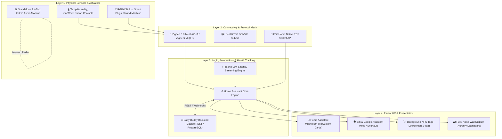
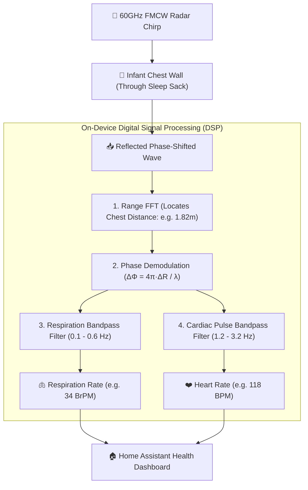
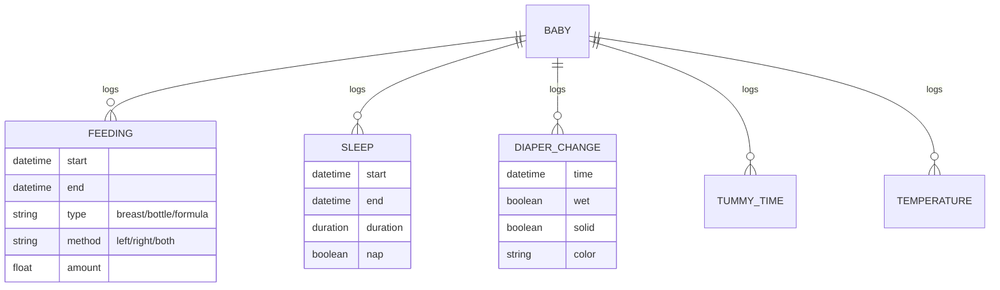
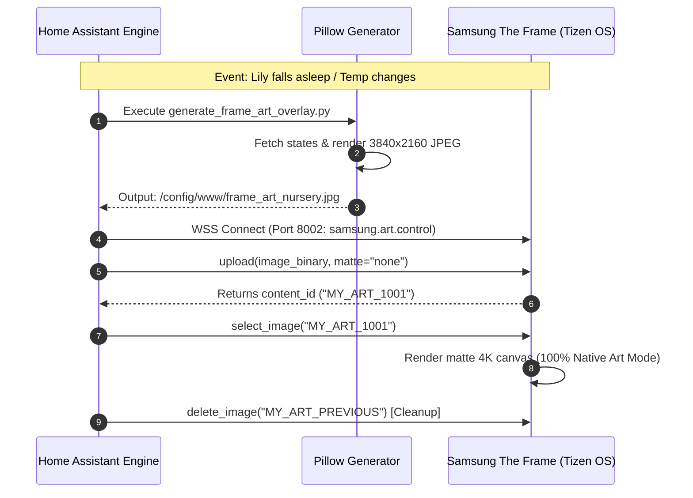

# 🔬 Smart Nursery Technology Stack & Architecture

This document provides a deep technical analysis of the software, protocols, hardware architectures, and security models powering **BabyStack**.

---

## 🏛️ System Architecture Overview

BabyStack utilizes a **four-layer local-first architecture**:



---

## 📡 Wireless Protocols Comparison

When building an automated nursery, choosing the correct wireless protocol is critical for battery longevity, network stability, and response speed.

| Feature | **Zigbee 3.0** *(Primary)* | **Thread / Matter** *(Emerging)* | **Wi-Fi (2.4 / 5 GHz)** | **Bluetooth LE** |
| :--- | :--- | :--- | :--- | :--- |
| **Topology** | Self-healing Mesh | IPv6-addressable Mesh | Star (Router Bottleneck) | Point-to-Point / Mesh |
| **Battery Life** | **2–4 Years** (CR2032/CR2450) | **1.5–3 Years** | Days to Weeks | 6–12 Months |
| **Latency** | **< 50 ms** | **< 30 ms** | Variable (100–1000ms) | 100–300 ms |
| **Router Congestion**| **Zero** (Dedicated Coordinator)| **Zero** (Thread Border Router)| High (Adds 20+ IP leases)| Minimal |
| **Best Use in Nursery**| Temp/Humidity, Buttons, Contacts | Future-proof smart plugs | High-bandwidth Video only | Beacons & Proximity |

### Why Zigbee & Thread Win for Nursery Sensors
1. **Sleep States**: Zigbee & Thread sensors remain in ultra-low-power sleep states until an environmental threshold is crossed (e.g. temperature change $\ge 0.2^\circ\text{C}$), drawing only microamperes.
2. **Mesh Redundancy**: Mains-powered Zigbee & Thread devices (such as smart plugs and light bulbs) act as *Routers / Repeaters*, extending mesh signal coverage through walls without adding load to your home Wi-Fi router.
3. **Coexistence with IKEA's Ecosystem (Zigbee + Matter over Thread)**:
   * **IKEA Sensors & Plugs (PARASOLL, VALLHORN, SOMRIG, VINDSTYRKA, INSPELNING)**: Use **Zigbee 3.0**.
   * **IKEA New Generation Bulbs (KAJPLATS)**: Use **Matter over Thread** (with an unadvertised fallback Zigbee mode).
   * **The Universal Hardware Key**: The **SMLIGHT SLZB-06M** uses the Silicon Labs **EFR32MG21** chip, natively supporting **both Zigbee 3.0 and OpenThread Border Router (Matter over Thread)** for Home Assistant!

---

## 📹 Video Streaming: Local RTSP vs Proprietary Cloud

### The Cloud Baby Monitor Problem
Commercial smart monitors (e.g., Nanit, Owlet, Miku) route video feeds through remote cloud servers (AWS/Azure). This introduces severe risks:
* **Outages**: If your ISP goes down or the company has server issues, parents lose their baby monitor feed in the middle of the night.
* **Latency**: Cloud video has a 3–8 second lag.
* **Privacy Vulnerabilities**: Risk of compromised accounts, third-party employee snooping, or unpatched manufacturer cloud APIs.

### The BabyStack Video Solution
* **Local Stream Ingestion**: The nursery camera serves high-definition H.264 video directly over your LAN via **RTSP (Real Time Streaming Protocol)** on port 554.
* **go2rtc & WebRTC**: Home Assistant's `go2rtc` trans-streams RTSP into WebRTC. This delivers:
  * **Sub-200ms latency** (real-time audio and video).
  * Direct peer-to-peer streaming from HA to your iPhone/iPad.
  * Zero internet bandwidth usage.

### 📻 The "Hybrid / Dual-Layer" Monitoring Philosophy (Infant Optics + HA)
* **Can Infant Optics (DXR-8 / DXR-8 PRO) link to Home Assistant?**
  * **No directly over the network**: Infant Optics is a closed-loop **2.4 GHz FHSS** (Frequency-Hopping Spread Spectrum) system. It has **no Wi-Fi chip, no IP address, and no API**.
* **Why this is intentional**:
  * **Layer 1 (Mission-Critical Nightstand Lifeline)**: Infant Optics gives you an unhackable, 0-latency physical screen on your bedside table with physical volume buttons that works 100% through Wi-Fi drops, server reboots, or internet outages.
  * **Layer 2 (Smart Nursery Integrations)**: A secondary $40 local RTSP camera (e.g. Reolink E1 Pro / Tapo C225) feeds Home Assistant for living room Samsung The Frame TV alerts, iPhone/Apple Watch widgets, and automated Baby Buddy sleep logging.

---

## 🫀 60GHz mmWave Radar: Contactless Heartbeat & Breathing Signal Processing



### 1. 24GHz vs 60GHz/77GHz Radar Differences
* **24GHz Radars (Aqara FP2 / Sonoff SNZB-06P)**: Excellent for room occupancy, macro presence, and gross breathing chest rise-and-fall ($5–15\text{ mm}$ displacement). Cannot reliably separate the microscopic heartbeat pulse from background noise.
* **60GHz / 77GHz Vital Signs Radars (Seeed Studio MR60BHA1 / TI IWR6843 / ESPHome)**: Operates with a 4GHz ultra-wide bandwidth. Has sub-millimeter phase precision ($\lambda = 5\text{ mm}$), enabling simultaneous extraction of both respiratory and cardiac pulse vibrations.

### 2. Accuracy Profile
* **In Still / Quiet Sleep**: **90% – 95% accuracy** compared against medical pulse oximeters and ECG.
* **During Active Movement / Crying**: Gross body movement ($50–200\text{ mm}$) overwhelms the tiny $0.2\text{ mm}$ heartbeat signal. The DSP automatically pauses BPM calculation during motion and resumes within 3 seconds of settling.

---

## 👶 Data Layer: Baby Buddy Architecture

**Baby Buddy** is a specialized Django-based open-source application designed specifically for pediatric activity tracking.



### Integration with Home Assistant
Baby Buddy provides a complete REST API. The Home Assistant integration polls and pushes state changes via Webhooks:
* **Calculated Entities**: `sensor.lily_last_feeding_timer`, `sensor.lily_feeding_side_suggested`, `sensor.lily_last_nap_duration`.
* **Action Services**: `baby_buddy.add_feeding`, `baby_buddy.add_diaper_change`, `baby_buddy.add_sleep_timer`.

---

## 🎨 Frontend & UX: Solving the "Aesthetic" Problem

To provide a modern, wife-approved, friction-free interface:

1. **Mushroom Cards**: We use Home Assistant's custom Mushroom Card UI library. Features include:
   * Soft rounded pastel cards.
   * Large, tactile 1-tap buttons with micro-animations.
   * Dynamic pill tags indicating current sleep state, last feed side, and room temperature status.
2. **iOS Shortcuts & Siri**:
   * Create native iOS Shortcuts linked to Home Assistant service calls.
   * Enables lock screen widgets and voice triggers (*"Hey Siri, Lily fell asleep"*).
3. **Matte NFC Stickers**:
   * Placed discreetly under wooden furniture surfaces.
   * Zero screen time: simply hold the top of an iPhone near the sticker to trigger a background webhook with haptic confirmation.
4. **Samsung The Frame TV (Living Room Canvas)**:
   * Uses local WebSocket Art API (`samsung-tv-ws-api` on port 8002) to upload dynamically composed 4K artwork with live baby telemetry directly into internal flash memory.

---

## 📺 Samsung The Frame TV: Art Mode Interface & Protocols



### Protocol Details:
* **Transport**: Local Secure WebSocket (`wss://<TV_IP>:8002/api/v2/channels/samsung.remote.control`).
* **Authentication**: Token-based pairing handshake (approved once on the TV screen).
* **Binary Framing**: Uploads raw binary JPEG chunks directly into the TV's internal storage buffer.
* **Service Calls**: Handled transparently by `ha-samsungtv-smart` via `samsungtv_smart.set_art`.

---

## 🛡️ Security, Threat Model & Redundancy

```
+-------------------------------------------------------------------------+
|                         THREAT MODEL & MITIGATIONS                      |
+-------------------------------------------------------------------------+
| Potential Failure / Threat     | BabyStack Countermeasure               |
+--------------------------------+----------------------------------------+
| 1. Internet Service Outage     | 100% Local LAN operation; video &      |
|                                | automations continue without WAN.      |
| ------------------------------ | -------------------------------------- |
| 2. Total Wi-Fi Router Crash    | Dedicated 2.4GHz FHSS Audio Monitor    |
|                                | remains 100% operational on battery.   |
| ------------------------------ | -------------------------------------- |
| 3. Nursery Camera Hacking Risk | Camera IP blocked at router firewall   |
|                                | from all outbound/inbound WAN access.  |
| ------------------------------ | -------------------------------------- |
| 4. Database / Storage Loss     | Automated nightly encrypted backups    |
|                                | exported via Home Assistant Google     |
|                                | Drive / WebDAV backup add-on.          |
+-------------------------------------------------------------------------+
```
